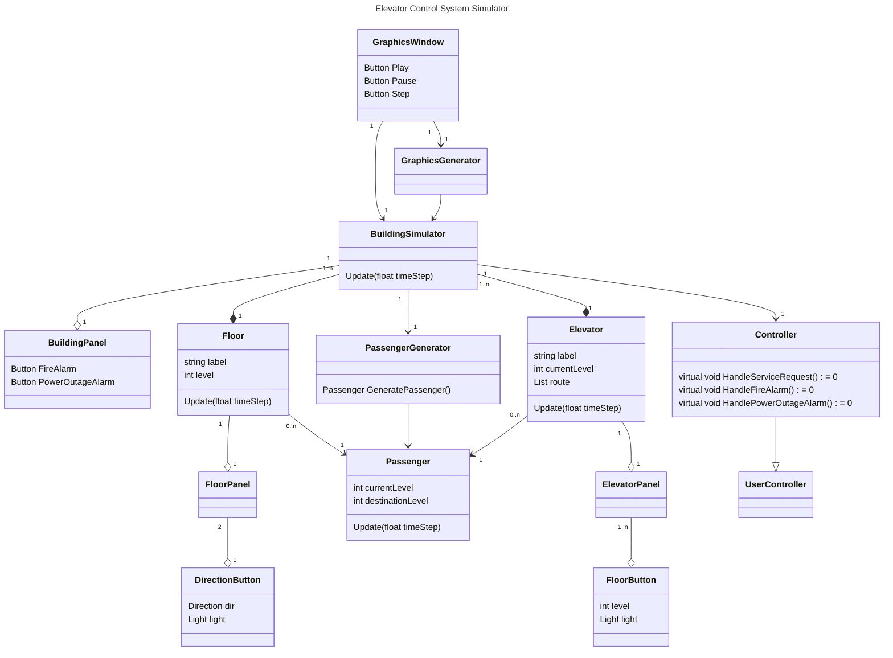

```mermaid
---
title: Elevator Control System Simulator
---
classDiagram
    BuildingSimulator "1" --o "1" BuildingPanel
    BuildingSimulator "1..n" --* "1" Floor
    BuildingSimulator "1" --> "1" PassengerGenerator
    BuildingSimulator "1..n" --* "1" Elevator
    BuildingSimulator "1" --> "1" Controller
   
    PassengerGenerator -->Passenger

    Controller --|> UserController

    Floor "1" --o "1" FloorPanel
  
    Floor "0..n" --> "1" Passenger
    Elevator "0..n" --> "1" Passenger

      Elevator "1" --o "1" ElevatorPanel

    FloorPanel "2" --o "1" DirectionButton
    ElevatorPanel "1..n" --o FloorButton

    GraphicsWindow"1" --> "1" BuildingSimulator
    GraphicsWindow "1" --> "1" GraphicsGenerator

    GraphicsGenerator-->BuildingSimulator

    class BuildingSimulator{
        Update(float timeStep)
    }

    class Floor{
        string label
        int level

        Update(float timeStep)
    }

    class Elevator{
        string label
        int currentLevel
        List route
        Update(float timeStep)
    }

    class Passenger{
        int currentLevel
        int destinationLevel
        Update(float timeStep)
    }

    class GraphicsWindow{
        Button Play
        Button Pause
        Button Step
    }

    class BuildingPanel{
        Button FireAlarm
        Button PowerOutageAlarm
    }

    class DirectionButton{
        Direction dir
        Light light
    }

    class FloorButton{
        int level
        Light light
    }

    class Controller{
        virtual void HandleServiceRequest() = 0
        virtual void HandleFireAlarm() = 0
        virtual void HandlePowerOutageAlarm() = 0
    }

    class PassengerGenerator{
        Passenger GeneratePassenger()
    }

```

  