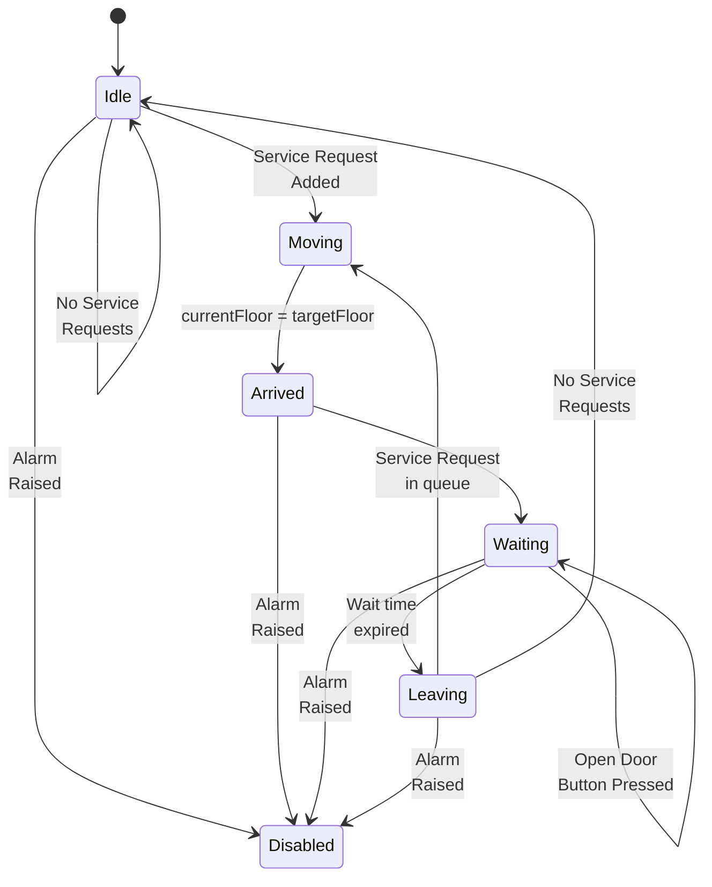

```mermaid
stateDiagram-v2
    [*] --> Idle
    
    Idle --> Moving : Service Request <br> Added
    Idle --> Idle : No Service <br> Requests
    Idle --> Disabled : Alarm<br>Raised

    Moving --> Arrived : currentFloor = targetFloor
    
    Arrived --> Waiting
    Arrived --> Disabled : Alarm<br>Raised

    Waiting --> Leaving : Wait time <br> expired
    Waiting --> Waiting : Open Door <br> Button Pressed 
    Waiting --> Disabled : Alarm<br>Raised

    Leaving --> Moving : Service Request <br> in queue
    Leaving --> Idle : No Service <br> Requests
    Leaving --> Disabled : Alarm<br>Raised
```